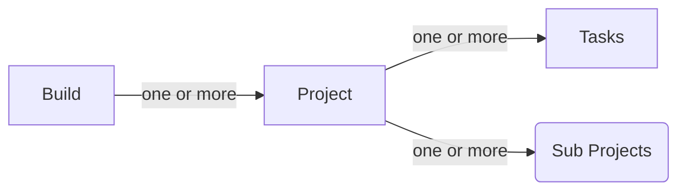

# Setting Project name
settings.gradle
 `rootProject.name="testme"`
or directory name

# Multi projects build
in root `settings.gradle`

`include 'sub-project-folder'`

the subproject can still be an independent gradle project, i.e you can go do sub-project and still do ./gradle clean run etc.

What happens when ?

1. ./gradlew clean
2. ./gradlew build (does it execute build in all projects)
3. ./gradle <specific task>

What common settings / configs can be stored in top level project

## Basics 


Build  1-M Project -- 1-M -- Tasks 
       Root Project --> sub-projects
----

## Delegates

```groovy
def printClosure = {
    printText "I come from a closure"
}
// delegate is called first
printClosure.delegate = new WriterOne()
printClosure() // will print "Printed in One: I come from a closure
printClosure.delegate = new WriterTwo()
printClosure() // will print "Printed in Two: I come from a closure
```